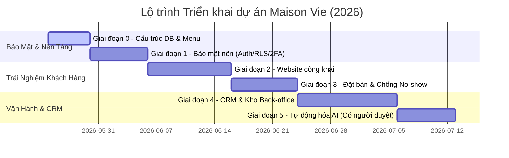

# KẾ HOẠCH TRIỂN KHAI TỔNG THỂ DỰ ÁN MAISON VIE
## Hệ thống Website công khai & CRM vận hành nội bộ (Édition 2026)

Tài liệu này tổng hợp toàn bộ lộ trình triển khai chi tiết 6 giai đoạn (từ Giai đoạn 0 đến Giai đoạn 5) cho dự án **Maison Vie - Cuisine Française Classique · Terroir Vietnamien**. Kế hoạch được xây dựng dựa trên tài liệu gốc chuẩn duy nhất `Maison_Vie_CauTruc_LoTrinh.docx` kết hợp với các quyết định kỹ thuật đã được thống nhất giữa Kỹ thuật viên triển khai và Chủ đầu tư.

---

## TỔNG QUAN HỆ THỐNG
* **Quy mô nhà hàng:** 250 chỗ ngồi (chia các khu vực: Tầng 1, Tầng 2, Phòng VIP).
* **Nền tảng công nghệ:** Supabase (PostgreSQL + Auth + Edge Functions + Storage) · Vercel · Resend · VNPT e-Invoice.
* **Cổng thanh toán:** Tích hợp song song **VNPAY** và **PAYOO**.
* **Ngôn ngữ hỗ trợ:** 5 ngôn ngữ (Tiếng Việt, Tiếng Anh, Tiếng Pháp, Tiếng Nhật, Tiếng Hàn).
* **Tiêu chuẩn chất lượng:** Định hướng chất lượng dịch vụ chuẩn Michelin, bảo mật dữ liệu nhạy cảm theo Nghị định 13/2023/NĐ-CP của Chính phủ.

---

## CHI TIẾT KẾ HOẠCH TRIỂN KHAI QUA CÁC GIAI ĐOẠN



---

### GIAI ĐOẠN 0: NỀN TẢNG (DATABASE & THỰC ĐƠN)
**Mục tiêu:** Xác lập cơ sở dữ liệu sạch và nội dung chuẩn hóa trước khi xây dựng mã nguồn giao diện.

* **Kiến trúc Database:**
  * Khởi dựng mới hoàn toàn cơ sở dữ liệu trên Supabase để đảm bảo hiệu năng và cấu trúc chuẩn hóa cao nhất (3NF).
  * Thiết kế các bảng dữ liệu bằng kiểu `JSONB` cho các cột đa ngôn ngữ (tên món, mô tả món) để hỗ trợ linh hoạt 5 ngôn ngữ (`vi`, `en`, `fr`, `ja`, `ko`).
* **Chuẩn hóa thực đơn và chất dị ứng:**
  * Import danh sách món ăn và giá cả chính thức từ file Excel Master Recipe v3.
  * Tích hợp bảng danh mục **14 nhóm chất gây dị ứng (Allergens)** chuẩn hóa theo quy định của Liên minh Châu Âu (EU).
  * Món ăn liên kết nhiều-nhiều với danh mục chất dị ứng qua bảng trung gian `menu_item_allergens` để phục vụ đối chiếu tự động.

---

### GIAI ĐOẠN 1: BẢO MẬT NỀN (AUTH, RLS, 2FA & AUDIT LOG)
**Mục tiêu:** Thiết lập xác thực máy chủ, phân quyền RLS chặt chẽ và cơ chế ghi vết bảo mật.

* **Xác thực người dùng:**
  * Tích hợp Supabase Auth với 3 vai trò chính: **ADMIN** (Chủ đầu tư - có quyền tối cao), **MANAGER** (Quản lý vận hành), và **CHEF** (Bếp trưởng quản trị khu vực BOH).
  * Kích hoạt xác thực hai yếu tố **2FA qua ứng dụng Authenticator App** (Google Authenticator) cho tài khoản ADMIN và các vị trí quản lý nhạy cảm.
* **Chính sách phân quyền RLS nâng cao:**
  * Bật RLS trên toàn bộ các bảng trong cơ sở dữ liệu.
  * **Ca làm việc động (Dynamic Shifts):** RLS phân quyền truy cập thông tin đặt bàn và gán bàn theo ca trực động. Đầu ca, Manager dùng Sơ đồ bàn 2D kéo thả gán nhân viên FOH vào các bàn/khu vực (Tầng 1, Tầng 2, VIP). Quyền truy cập ghi/đọc dữ liệu khách hàng tương ứng của nhân viên FOH sẽ tự động kích hoạt theo bảng phân công này.
  * *Ranh giới bảo mật thời gian:* Nhân viên FOH chỉ được xem đơn đặt bàn thuộc ca trực và ngày hiện tại/tương lai (`booking_date >= CURRENT_DATE`). Đầu bếp (CHEF/BOH) chỉ được đọc dữ liệu dị ứng (`allergen_preferences`) của khách có đơn đặt bàn hôm nay để chuẩn bị nguyên liệu.
* **Hệ thống Ghi vết (Audit Log):**
  * Viết Postgres Trigger chạy ngầm ở mức cơ sở dữ liệu tự động ghi vết mọi hành động thay đổi dữ liệu nhạy cảm (Tạo, Sửa, Xóa - CUD) vào bảng `audit_log`. Cấm hoàn toàn hành động xóa log (kể cả MANAGER).
* **Bảo vệ quyền riêng tư & Ngăn ngừa Rò rỉ dữ liệu Khách VIP (VIP Privacy & Insider Threat Prevention - THÊM MỚI):**
  * Khách hàng của Maison Vie có thể bao gồm các nhân vật nổi tiếng, doanh nhân hoặc các cuộc họp tuyệt mật. Hệ thống CRM tự động ẩn danh thông tin của khách hàng có nhãn `VIP_Level_3` (Thượng khách).
  * Trên màn hình sơ đồ bàn và KDS công cộng, tên khách VIP được hiển thị dưới dạng mã ẩn danh (ví dụ: *"Mr. V - Confidential Room VIP 1"*).
  * Chỉ duy nhất Quản lý Sảnh (General Manager) hoặc Admin đã xác thực 2FA mới được nhấn nút "Giải mã Thông tin" để xem tên thật và số điện thoại. Mỗi lượt nhấn giải mã sẽ tự động:
    1. Chèn watermark chìm mờ chứa Tên và Mã nhân viên của người đang xem lên giao diện hiển thị nhằm răn đe tâm lý và phục vụ truy vết rò rỉ (Forensic Tracing & Deterrence) khi xảy ra sự cố, thay vì tạo cảm giác an toàn ảo tưởng (chụp ảnh vật lý bằng thiết bị khác không thể chặn được).
    2. Ghi một bản ghi nhật ký đặc biệt vào bảng `vip_access_logs` (Lưu vết: Ai truy cập, Xem lúc nào, Thiết bị nào, Xem thông tin của ai) để phục vụ đối soát an ninh tuyệt mật.
* **Tuân thủ Nghị định 13/2023/NĐ-CP về Bảo vệ dữ liệu cá nhân nhạy cảm (Allergen Health Data Encryption & DPIA - THÊM MỚI):**
  * **Cơ sở pháp lý & Thủ tục hành chính:** Dữ liệu dị ứng của khách hàng liên quan trực tiếp đến sức khỏe cá nhân, do đó được xếp vào nhóm **Dữ liệu cá nhân nhạy cảm** theo Nghị định 13/2023/NĐ-CP. Nhà hàng bắt buộc phải thiết lập quy trình xin ý kiến đồng ý rõ ràng (Consent Form chi tiết) của khách hàng và lập **Báo cáo Đánh giá tác động xử lý dữ liệu cá nhân (DPIA)** theo đúng Mẫu số 02 của Nghị định để nộp gửi Cục An ninh mạng và phòng, chống tội phạm sử dụng công nghệ cao (A05) - Bộ Công an trong vòng 60 ngày kể từ khi bắt đầu xử lý.
  * **Kỹ thuật Mã hóa tầng Database (AES-256):** Loại bỏ hoàn toàn giải pháp bảo mật ảo tưởng chỉ ẩn dữ liệu ở frontend. Bắt buộc thực hiện mã hóa đối xứng **AES-256-GCM** (hoặc thông qua pgsodium/Supabase Vault) đối với các cột lưu trữ dữ liệu dị ứng (`allergen_preferences`, `allergen_notes`) trực tiếp dưới tầng PostgreSQL trước khi ghi dữ liệu xuống đĩa. Khóa mã hóa được lưu giữ tách biệt an toàn tại Key Management Service (KMS). Việc giải mã chỉ được thực hiện trên RAM thông qua các API bảo mật được xác thực và chỉ cho phép truy xuất trong ca làm việc được chỉ định qua RLS.

---

### GIAI ĐOẠN 2: WEBSITE CÔNG KHAI (VISUAL & TỐI ƯU HIỆU NĂNG)
**Mục tiêu:** Dựng diện mạo website sang trọng, sửa triệt để lỗi font chữ tiếng Việt và xây dựng hệ thống các trang dịch vụ, truyền thông đầy đủ để tối ưu hóa SEO và chuyển đổi.

* **Sửa font và Thiết kế Visual:**
  * Nhúng bộ font cao cấp hỗ trợ đầy đủ 100% glyphs tiếng Việt: **Cormorant Garamond** (Serif cổ điển sang trọng kiểu Pháp cho tiêu đề) kết hợp **Outfit** (Sans-serif hiện đại, dễ đọc cho nội dung).
  * Sử dụng tông tối huyền bí kết hợp ánh kim trầm (Metallic Gold Gradient), đảm bảo độ tương phản khả dụng tối thiểu đạt chuẩn **WCAG AA (4.5:1)**.
* **Bố cục các trang công khai & Giải pháp tích hợp:**
  * **Loại bỏ hoàn toàn** các cụm từ tự phong không phù hợp fine dining như "6 sao" để giữ hình ảnh sang trọng, tinh tế.
  * **Trang Blog tin tức & Kiến thức ẩm thực (`/blog` & `/blog/[slug]`):** 
    * Cho phép đăng tải các bài viết, kiến thức rượu vang, ẩm thực Pháp.
    * *Tích hợp SEO:* Mỗi bài viết trong DB sẽ lưu trữ các trường Meta thông minh (`seo_title`, `seo_description`, `seo_keywords`). Hệ thống tự động sinh tệp `sitemap.xml`, thẻ OpenGraph phục vụ chia sẻ mạng xã hội và định dạng dữ liệu có cấu trúc `BlogPosting` (JSON-LD) giúp Google index nhanh chóng và hiển thị đẹp mắt.
  * **Trang Wine List (`/wine-list`):**
    * Dựng sẵn template danh mục rượu vang phong phú để import sau. Cấu trúc template bao gồm: Giống nho (Grape Variety), Vùng sản xuất (Region), Quốc gia (Country), Niên vụ (Vintage), Thể tích (Volume) và gợi ý Pairing món ăn.
    * **Tự động hóa kết hợp món - rượu (Smart Cross-Pairing Heuristics):** Kết nối dữ liệu rượu vang và thực đơn món ăn.
      * Món ăn được gán thuộc tính (`thịt_đỏ`, `hải_sản`, `đậm_vị`, `cay`...). Rượu vang được gán thuộc tính (`chát_đậm`, `chua_thanh`, `ngọt_nhẹ`...).
      * Database Trigger tự động ghép cặp các chai vang `available` phù hợp nhất để hiển thị làm gợi ý mặc định dưới mỗi món ăn trên trang `/menu` và ngược lại trên trang `/wine-list`.
      * Khi một món ăn hoặc chai vang hết hàng, hệ thống tự động gỡ liên kết pairing trên web theo thời gian thực. Manager có toàn quyền ghi đè (override) thủ công thiết lập pairing theo ý muốn trực tiếp từ CRM.
  * **Trang Khuyến mãi & Offers của tháng (`/offers`):**
    * Thiết kế như một Landing Page độc lập giới thiệu các chương trình ưu đãi, thực đơn đặc biệt theo tháng/mùa. Cho phép Manager cấu hình nội dung và nút Kêu gọi hành động (CTA) trực tiếp từ CRM mà không cần sửa code.
  * **Trang Sự kiện sắp tới (`/upcoming-events`):**
    * Danh sách các đêm tiệc văn hóa ẩm thực, sự kiện thử rượu vang sắp diễn ra kèm form đăng ký tham dự hoặc đặt chỗ trước.
  * **Trang Đối tác (`/partners`):**
    * Trưng bày trang trọng biểu tượng của các đối tác lữ hành, nhà cung cấp sản phẩm thực phẩm, các hãng rượu vang cao cấp đang đồng hành cùng Maison Vie.
  * **Trang Tuyển dụng (`/careers`):**
    * Hiển thị các vị trí công việc đang tuyển dụng (Sommelier, FOH, Chef de Partie...).
    * *Giải pháp nộp hồ sơ an toàn:* Ứng viên nộp CV trực tiếp qua form. File CV (.pdf, .docx) được đẩy thẳng lên một Bucket riêng biệt trên **Supabase Storage** có cấu hình bảo mật chỉ cho phép Admin/Manager tải xuống. Edge Function sẽ kiểm tra dung lượng (< 5MB) và định dạng file nghiêm ngặt để phòng chống mã độc tấn công hệ thống.
  * **Các trang khác:** Trang chủ (`/`), Thực đơn (`/menu`), Bếp trưởng (`/chef`), Không gian & Kiến trúc (`/ambiance`), Thư viện sự kiện đã qua (`/events`), Liên hệ (`/contact`).
* **Giải pháp kỹ thuật tối ưu hóa tốc độ tải trang:**
  * Áp dụng cơ chế **Incremental Static Regeneration (ISR)** trên Vercel cho trang Blog, Wine List, Offers để tải trang ngay lập tức.
  * Tất cả hình ảnh trong thư viện, bài viết sẽ được nén sang định dạng **WebP/AVIF** siêu nhẹ và áp dụng kỹ thuật **Lazy Loading (tải chậm)**. Các widget của TripAdvisor và Facebook được thiết lập tải bất đồng bộ (`async/defer`) sau khi trang chính đã load xong.

---

### GIAI ĐOẠN 3: ĐẶT BÀN & CHỐNG NO-SHOW
**Mục tiêu:** Xây dựng luồng đặt bàn thông minh, chống race condition và tích hợp cổng thanh toán giữ chỗ.

* **Quy trình đặt bàn giờ cao điểm:**
  * Thiết lập giờ cao điểm thực tế từ **18:00 - 20:30**. 
  * Mọi đơn đặt bàn trong khung giờ này bắt buộc phải qua **DUYỆT THỦ CÔNG** bởi MANAGER/ADMIN để đảm bảo sắp xếp sơ đồ 250 chỗ ngồi tối ưu. 
  * Giao diện Website chỉ xác nhận tự động đã tiếp nhận yêu cầu và thông báo: *"Maison Vie đã tiếp nhận yêu cầu đặt bàn của quý khách và đang sắp xếp sơ đồ bàn ăn tối ưu nhất. Đội ngũ lễ tân sẽ liên hệ lại bằng email/điện thoại để xác nhận chính thức trong ít phút."*
  * **Hệ thống Cảnh báo Khẩn cấp (FOH Alert):** Khi có đơn đặt bàn mới cần duyệt trong giờ cao điểm, hệ thống CRM nội bộ sẽ phát âm thanh cảnh báo lớn tại quầy lễ tân và tự động gửi tin nhắn thông báo tức thì (Push Notification) đến nhóm Telegram nội bộ của quản lý ca trực để đảm bảo phản hồi cho khách trong vòng tối đa 5 phút.
* **Nhịp bếp và Chống Overbooking:**
  * Cấu hình giới hạn nhịp tiếp đón tối đa **20 khách đặt mới trong mỗi 15 phút** để tránh quá tải bếp.
  * **Cơ chế Đặt giữ mềm (Soft Reservation) chống nghẽn DB:** Tuyệt đối không sử dụng `SELECT ... FOR UPDATE` để giữ transaction mở trong 10 phút thanh toán vì sẽ gây cạn kiệt connection pool và làm sập hệ thống dưới tải. Thay thế bằng cơ chế **Soft Reservation**: Khi khách bắt đầu thanh toán, bàn được ghi nhận đặt chỗ ở trạng thái `pending_payment` kèm timestamp hết hạn `expires_at = NOW() + INTERVAL '10 minutes'`. Các truy vấn tìm bàn trống sẽ bỏ qua những bàn đang giữ mềm chưa hết hạn này. Sử dụng **Supabase Cron Job (pg_cron)** quét mỗi 1 phút để tự động chuyển các đơn quá hạn sang trạng thái `expired`, giải phóng bàn tức thì mà không cần mở transaction kéo dài.
* **Tích hợp thanh toán và Email (Tối ưu hóa DNS cho Google Business):**
  * Tích hợp song song cổng thanh toán **VNPAY** và **PAYOO** để thu tiền đặt cọc giữ chỗ chống no-show.
  * **Cơ chế Đặt cọc & Phí phạt đa tầng (Dynamic Multi-Tier Deposit - CẬP NHẬT MỚI):**
    * Tự động tính toán số tiền cọc tối thiểu dựa trên số khách (`guest_count`) và giá trị thực đơn đã chọn (đề xuất cọc tối thiểu 500k/bàn thường, cọc 20% tổng giá trị dự kiến cho bàn tiệc/đoàn lớn).
    * Áp dụng phí phạt hủy bàn theo bậc thang thời gian: Hủy trước 48h (hoàn 100%), Hủy từ 24h-48h (phạt 50%), Hủy dưới 24h/no-show (phạt 100% cọc).
    * Cung cấp nút **Miễn phạt ngoại lệ (Penalty Waiver)** cho Admin/Manager phê duyệt hoàn cọc 100% trong trường hợp bất khả kháng chính đáng.
  * **Giải pháp DNS an toàn cho hòm thư Google Business hiện tại:**
    - Để không ảnh hưởng đến luồng gửi/nhận email giao tiếp hàng ngày của nhà hàng đang chạy trên **Google Workspace (Google Business)**, chúng tôi sẽ cấu hình Resend gửi email tự động từ một tên miền phụ độc lập (Subdomain) chuyên dụng, ví dụ: `@booking.maisonvie.vn`.
    - Cấu hình các bản ghi **SPF, DKIM, và DMARC** riêng biệt cho subdomain này trên hệ thống DNS. Bản ghi MX của tên miền chính `@maisonvie.vn` trỏ về Google được giữ nguyên 100%. Cách làm này bảo vệ uy tín của tên miền chính và tránh hoàn toàn nguy cơ email Google Business bị đánh dấu spam.
  * **Hệ thống Xếp hàng & Phân phối Email dự phòng tránh bị đánh dấu Spam (Email Deliverability Queue - THÊM MỚI - ĐÃ DUYỆT):**
    - Vào ngày lễ, lượng email gửi xác nhận, nhắc cọc tăng đột biến dễ bị các bộ lọc Gmail/Outlook của khách coi là spam.
    - CRM tích hợp Queue chạy ngầm (Supabase PG-Boss) để giãn nhịp gửi (tối đa 5 email/phút, khoảng cách ngẫu nhiên 5-15 giây giữa các email).
    - CRM hiển thị chỉ số Bounce Rate (tỷ lệ email lỗi) từ Resend API thời gian thực. Nếu Bounce Rate vượt quá 2%, hệ thống tạm dừng gửi tự động và chuyển cảnh báo yêu cầu FOH gọi điện thoại trực tiếp hoặc gửi tin nhắn SMS Brandname đã khai báo để đảm bảo thông tin liên lạc 100% đến khách hàng.
  * Hỗ trợ luồng Đăng ký danh sách chờ (Waitlist) khi khung giờ cao điểm bị khóa tự động.
  * **Tự động hóa Khớp Waitlist (Smart Waitlist Matching):** Khi một bàn đặt trong giờ cao điểm bị hủy (`cancelled`), hệ thống tự động quét danh sách chờ, chọn đơn có số khách phù hợp nhất và tự động gửi email/SMS chứa link giữ chỗ trong 10 phút. Nếu quá 10 phút không thanh toán cọc, hệ thống tự động chuyển cơ hội cho người tiếp theo trong hàng đợi.
* **Import Đơn đặt bàn hàng loạt B2B (B2B Bulk Import & Dynamic Recipe Amendment - CẬP NHẬT MỚI):**
  * Hỗ trợ tính năng import danh sách đặt bàn hàng loạt cho các đối tác lữ hành đã ký hợp đồng công nợ. Manager có thể upload file Excel/CSV theo mẫu (chứa: Tên đoàn, Tên hướng dẫn viên, Số khách, Set Menu chọn trước, Dị ứng). Hệ thống tự động parse file, xác thực công nợ đại lý và ghi nhận hàng loạt reservations ở trạng thái `B2B_Confirmed` mà không cần nhập tay.
  * **Cơ chế Phiếu điều chỉnh Set Menu B2B phút chót (B2B Menu Amendment - ĐÃ DUYỆT):** Khi đại lý lữ hành yêu cầu thay đổi Set Menu hoặc đổi món cho một số khách lẻ trong đoàn sát giờ ăn (ví dụ đổi 5 suất Bò sang Cá hồi), Manager nhập phiếu điều chỉnh trên CRM. Postgres Transaction tự động thu hồi định lượng nguyên liệu cũ, giải phóng kho hủy sơ chế và tái phân rã trừ kho nguyên liệu mới theo thời gian thực, đảm bảo giá vốn món ăn (Food Cost) cuối ca của Bếp trưởng chính xác tuyệt đối.
* **Checklist chuẩn bị Tiệc riêng tư & Sự kiện VIP (Private Event Details):**
  * Đối với các đơn đặt phòng VIP/Tiệc sự kiện thượng lưu, hệ thống kết nối 1-1 đơn đặt bàn với bảng **Checklist Dịch vụ Gia tăng** (setup hoa tươi, in menu riêng từng khách, âm thanh ánh sáng).
  * CRM nội bộ cung cấp màn hình Dashboard quản lý tiến độ chuẩn bị và tự động gửi nhắc nhở (Alert) cho bộ phận FOH/IT trước 4 giờ sự kiện bắt đầu để chuẩn bị hoàn hảo tuyệt đối.

---

### GIAI ĐOẠN 4: CRM & KHO BACK-OFFICE (VẬN HÀNH NỘI BỘ)
**Mục tiêu:** Số hóa toàn diện quy trình phục vụ từ sơ đồ bàn, vé bếp, quầy bar, POS thanh toán và kiểm soát kho nguyên liệu thô.

* **Quy trình vận hành nội bộ (POS, KDS Bếp & BDS Quầy Bar nâng cao):**
  * **Module Sơ đồ bàn 2D & Quản lý thời gian bàn ăn:** 
    * Thiết lập bản đồ kéo thả quản lý 250 chỗ ngồi thời gian thực.
    * **Quy ước thời gian sử dụng bàn:** Mỗi bàn ăn khi có khách bắt đầu order (`status = active`), hệ thống tự động khóa bàn đó trên sơ đồ và đặt thời gian giải phóng bàn dự kiến: `estimated_release_time = active_at + 120 minutes` (2 giờ). Hệ thống gán bàn và đặt chỗ trực tuyến sẽ tự động **chặn đứng (auto-block)** việc setup các đơn đặt bàn mới trùng vào bàn đó trong khoảng 120 phút này để tránh overbooking/trùng lặp khi khách vẫn còn ngồi.
    * **Chuyển và Hợp nhất Bàn ăn thời gian thực (Table Swapping):** FOH dễ dàng kéo thả đổi bàn cho khách (ví dụ từ Bàn 5 sang Bàn 12). Postgres Transaction tự động chuyển toàn bộ order dở dang, cập nhật tức thì nhãn bàn trên KDS/BDS Bếp và Bar qua WebSockets, đồng thời giải phóng bàn cũ và khóa bàn mới 120 phút liên tục mà không làm gián đoạn hay mất mát dữ liệu order.
  * **KDS Bếp & Điều phối món theo nhịp Fine Dining:**
    * Khi khách ăn xong khai vị, nhân viên FOH nhấn nút "Fire Main Course" trên POS cầm tay. Màn hình KDS lập tức nhấp nháy đỏ báo hiệu Chef/BOH bắt đầu chế biến món chính.
    * **KDS-to-FOH Runner Alert (Gọi phục vụ):** Khi đầu bếp làm xong món nào cho bàn, họ sẽ nhấn chọn món đó trực tiếp trên màn hình KDS. Hệ thống sẽ phát âm thanh chuông báo tại quầy và gửi rung/thông báo tức thì đến thiết bị cầm tay của nhân viên FOH chạy bàn (runners) để đến bê món phục vụ ngay, đảm bảo món ăn nóng sốt.
    * **Chế độ Phục vụ Đoàn lớn (Gala/Group Serving Mode):** Để xử lý kịch bản **200 khách vào dùng bữa cùng một thời điểm** (tiệc Gala, hội nghị) mà không gây sập bếp, Manager có thể kích hoạt Gala Mode trên KDS. Khi đó, hệ thống tự động gộp (aggregate) các order đơn lẻ thành **Từng lô sản xuất (Batch Cooking)**. Đầu bếp chế biến đồng loạt số lượng lớn theo lô, và FOH bê món đồng bộ theo tuyến bàn đã được phân công.
    * **Chế độ Dự phòng Sự cố Thiết bị Bếp (Kitchen Equipment Disaster Mode - KED - CẬP NHẬT MỚI):** Trên màn hình KDS của Chef, thiết lập danh mục các thiết bị cốt lõi (Lò nướng combi, bếp chiên nhúng...). Khi có sự cố hỏng hóc, Chef nhấn 1 nút "Báo hỏng lò nướng" trên KDS. CRM lập tức khóa (disable) hàng loạt tất cả các món ăn đòi hỏi thiết bị đó chế biến trên tất cả POS cầm tay của FOH và Web công khai trong 1 giây để tránh nhận nhầm order, đồng thời cảnh báo khẩn cho lễ tân.
  * **Bar Display System - BDS (KDS Quầy Bar & Pha chế):**
    * Đồ uống cần lên bàn siêu tốc (1-3 phút). Để tránh làm loãng KDS Bếp và chậm trễ đồ uống, hệ thống thiết lập màn hình **BDS riêng biệt tại Quầy Bar**. 
    * POS tự động phân tách luồng (Order Routing): Món ăn đẩy xuống KDS Bếp, đồ uống (nước ép, cocktail, rượu vang) đẩy trực tiếp xuống BDS Quầy Bar. BDS cũng tích hợp chuông báo gọi phục vụ FOH khi Bartender pha chế xong.
  * **Kiến trúc Chống Mất Mạng Ngoại Tuyến (Offline-First Hybrid Architecture):**
    * Để đề phòng sự cố đứt cáp internet vào giờ cao điểm, CRM thiết kế dạng PWA kết hợp cơ sở dữ liệu cục bộ **IndexedDB**. 
    * Khi mất mạng, hệ thống tự động chuyển sang **Offline Mode** (nhân viên vẫn order, chạy bàn, KDS và in bill bình thường qua mạng LAN nội bộ). Khi internet khôi phục, bộ Sync Engine tự động đẩy dữ liệu lên Supabase Cloud.
    * **Cơ chế đồng bộ giải quyết xung đột (Conflict Resolution Protocol):** Sử dụng cơ chế gán UUID cho từng dòng order (`order_items`) sinh từ máy khách kết hợp thuộc tính `last_updated_at` (mốc thời gian cục bộ). Khi đồng bộ, hệ thống chạy Postgres Transaction dùng kỹ thuật **UPSERT (Last-Write-Wins)** để cập nhật dòng order mới nhất, tránh tình trạng FOH dùng 2 máy khác nhau cập nhật cùng một bàn gây mất món hoặc nhân đôi món tại KDS Bếp. Nếu phát hiện chênh lệch số lượng món đã làm và món mới cập nhật, hệ thống tự in phiếu cảnh báo "CẬP NHẬT ĐỔI MÓN" tại KDS Bếp để Chef đối soát.
  * **Khóa Menu ca trực tránh xung đột hóa đơn (Mid-Shift Menu Lock - CẬP NHẬT MỚI):** Mọi thay đổi về giá cả, cấu trúc món ăn trên CRM chỉ được lưu ở trạng thái chờ (`pending_activation`) và chỉ được áp dụng hàng loạt tại thời điểm giao ca hoặc đóng cửa ngày. POS ca trực đang chạy sẽ sử dụng menu đã khóa cache để tránh lỗi lệch giá bill của khách đang dùng bữa và lỗi đồng bộ ứng dụng di động của FOH.
  * **Module Lộ trình Đào tạo & Thăng tiến Nhân sự theo cấp bậc (CRM Integrated Training & Promotion Paths - CẬP NHẬT CHI TIẾT):**
    * **Tích hợp sâu trong CRM nội bộ:** Hệ thống quản trị học tập (LMS) hoàn toàn ẩn với bên ngoài, cho phép quản lý tài liệu SOP, video bài giảng (lưu trữ link liên kết bảo mật) và theo dõi tiến độ của từng nhân viên.
    * **Quy trình Đào tạo & Lộ trình Thăng tiến chi tiết cho từng vị trí:**
      1. **Cấp bậc 1: RUNNER (Nhân viên Tiếp thực):**
         - *Nội dung bắt buộc học (2 tuần):* SOP 01 (Vận hành KDS & Runner Alert), SOP 02 (Kỹ thuật bưng khay nặng, bê đĩa chuẩn fine dining không chạm lòng đĩa), SOP 03 (Học thuộc lòng sơ đồ bàn 2D và 250 chỗ ngồi), SOP 04 (Nhận diện 14 nhóm dị ứng EU).
         - *Bài kiểm tra & Đánh giá:* Vượt qua bài trắc nghiệm 15 câu trên CRM (tối thiểu 13/15 câu đúng về sơ đồ bàn/dị ứng) + Đánh giá thực hành (Roleplay vượt chướng ngại vật sảnh tiệc giờ cao điểm với khay 5 đĩa giả định).
         - *Lộ trình thăng tiến:* Làm việc tối thiểu **30 ngày** ở vị trí Runner + Hoàn thành 100% ca trực không xảy ra sự cố đổ vỡ vật chất (đối chiếu qua bảng Spoilage Log) + Vượt qua khóa đào tạo Waitstaff Level 1.
      2. **Cấp bậc 2: WAITSTAFF (Nhân viên Phục vụ chính):**
         - *Nội dung bắt buộc học (4 tuần):* SOP 05 (Quy chuẩn đón tiếp, kéo ghế, trải khăn ăn cho khách), SOP 06 (Giải nghĩa thực đơn Pháp-Việt & kể câu chuyện triết lý ẩm thực), SOP 07 (Khai thác dị ứng tại bàn & cập nhật POS phút chót), SOP 08 (Kỹ năng Upselling rượu vang kèm món ăn).
         - *Bài kiểm tra & Đánh giá:* Trắc nghiệm 20 câu trên CRM (tối thiểu 18/20 câu) + Nhập vai thực tế (Roleplay) xử lý khiếu nại tại bàn của khách hàng khó tính (được Manager sảnh chấm điểm trực tiếp trên CRM).
         - *Lộ trình thăng tiến:* Làm việc tối thiểu **90 ngày** ở vị trí Waitstaff + Điểm đánh giá chất lượng phục vụ trung bình từ khách hàng đạt từ 4.8/5 sao (đối chiếu qua Tableside Feedback) + Vượt qua bài kiểm tra lý thuyết Sommelier Basic & kỹ năng Decanting.
      3. **Cấp bậc 3: HOSTESS (Nhân viên Đón tiếp / Lễ tân sảnh):**
         - *Nội dung bắt buộc học (3 tuần):* SOP 13 (Quy chuẩn chào đón sang trọng chuẩn Michelin, nhận diện VIP và Thường khách), SOP 14 (Nghi thức đối thoại điện thoại lịch thiệp, xử lý email đặt chỗ), SOP 15 (Điều phối sơ đồ bàn 2D tối ưu chỗ ngồi), SOP 16 (Quy trình quản lý hàng đợi Waitlist giờ cao điểm).
         - *Bài kiểm tra & Đánh giá:* Trắc nghiệm 15 câu trên CRM (đạt tối thiểu 13/15 câu) + Nhập vai thực tế xử lý từ chối khéo léo khi khách vãng lai (walk-in) đòi bàn trong khung giờ cao điểm đã kín chỗ.
         - *Lộ trình thăng tiến:* Làm việc tối thiểu **6 tháng** -> Trưởng nhóm đón tiếp (Lead Hostess) hoặc Giám sát sảnh (Supervisor).
      4. **Cấp bậc 4: BARTENDER (Nhân viên Pha chế):**
         - *Nội dung bắt buộc học (4 tuần):* SOP 17 (Công thức pha chế các loại Cocktails Pháp-Việt tiêu chuẩn), SOP 18 (Kỹ thuật lắc/khuấy, lựa chọn ly thủy tinh pha lê cao cấp), SOP 19 (Quy trình nhập-xuất-tồn kho Bar biệt lập và Opened Bottles Log rượu mạnh đong ly), SOP 20 (Vận hành màn hình BDS quầy Bar).
         - *Bài kiểm tra & Đánh giá:* Pha chế trực tiếp 5 loại cocktail tiêu chuẩn trong 10 phút đạt chuẩn thẩm mỹ và hương vị + Trắc nghiệm 15 câu về định mức Recipe (yêu cầu đạt 100% điểm).
         - *Lộ trình thăng tiến:* Làm việc tối thiểu **6 tháng** ở vị trí Bartender -> Trưởng quầy Bar (Head Bartender) hoặc Giám sát đồ uống (Beverage Supervisor).
      5. **Cấp bậc 5: SOMMELIER / CAPTAIN (Chuyên gia rượu vang / Trưởng nhóm phục vụ):**
         - *Nội dung bắt buộc học (8 tuần):* SOP 09 (Wine Bible - sâu sắc về 50+ giống nho và vùng vang thế giới), SOP 10 (Nghi thức phục vụ vang cao cấp, sử dụng Coravin, decanting vang cổ), SOP 11 (Nghệ thuật Dynamic Pairing ẩm thực - rượu vang), SOP 12 (Vận hành kho vang ký gửi, rượu hỏng Corked Wine).
         - *Bài kiểm tra & Đánh giá:* Trắc nghiệm chuyên sâu 30 câu trên CRM (tối thiểu 27/30) + Thực hành Decanting thực tế trước hội đồng Manager & Admin + Blind Tasting (Thử mù phân biệt các nhóm rượu vang cơ bản).
         - *Lộ trình thăng tiến:* Làm việc tối thiểu **12 tháng** -> Giám sát đồ uống (Beverage Manager) hoặc Quản lý sảnh (Restaurant Manager).
      6. **Cấp bậc 6: SHIFT MANAGER / CA TRƯỞNG VẬN HÀNH:**
         - *Nội dung bắt buộc học (6 tuần):* SOP 21 (Kỹ năng quản trị, lãnh đạo và điều phối sơ đồ bàn 2D kéo thả gán nhân sự), SOP 22 (Quy trình ứng phó khẩn cấp KED bếp), SOP 23 (Quy trình Drawer Handover kết ca trực, Drawer đối soát két tiền), SOP 24 (Vận hành B2B Commission Ledger và VNPT e-Invoice).
         - *Bài kiểm tra & Đánh giá:* Trắc nghiệm quản trị 25 câu trên CRM (đạt tối thiểu 22/25) + Thực hành giả định xử lý khủng hoảng (lò bếp hỏng, POS sập mạng LAN hoặc khách bị sốc phản vệ).
    * **Chặn phân ca dựa trên kỹ năng (Skill-based Shift Assignment) & Cơ chế giải quyết nút thắt (Manager OverridePrivilege):**
      - Khi Manager thực hiện gán ca trực sảnh trên sơ đồ bàn 2D đầu giờ, CRM đối chiếu chứng chỉ trong DB. Nếu nhân viên chưa hoàn thành chứng chỉ kỹ năng tương ứng (ví dụ: *Quy trình phục vụ VIP*), CRM tự động cảnh báo đỏ và khóa chặn không cho phép gán.
      - **Manager Override Privilege (Ghi đè đặc quyền khẩn cấp):** Để tránh "đóng băng" vận hành khi thiếu hụt nhân sự do đau ốm đột xuất, Quản lý ca có quyền quét thẻ NFC/nhập mã OTP đặc cách để tạm thời gán Waitstaff chưa đạt chứng chỉ phục vụ VIP. Hệ thống sẽ:
        1. Tự động ghi vết sự việc vào Audit Log gửi báo cáo về tài khoản Admin kèm lý do giải trình bắt buộc.
        2. Tự động gắn nhãn cảnh báo đỏ nhấp nháy trên CRM của bàn đó để Captain sảnh tăng cường giám sát hỗ trợ, bảo vệ chất lượng phục vụ tối cao.
    * **Phòng chống gian lận thi cử trắc nghiệm trên CRM (Anti-Cheating Quiz Engine - THÊM MỚI):**
      - **Ngân hàng câu hỏi động:** Mỗi lần nhân viên nhấn "Bắt đầu làm bài thi" trên máy tính bảng CRM, hệ thống tự động xáo trộn ngẫu nhiên câu hỏi và đáp án từ ngân hàng 100 câu hỏi SOP của từng vị trí, loại bỏ tuyệt đối rủi ro chụp ảnh đáp án truyền tay nhau.
      - **Chế độ kiểm tra có giám sát (Proctored Mode):** Bắt buộc nhân viên quét FaceID (hoặc yêu cầu Manager nhập OTP phê duyệt coi thi) để kích hoạt chế độ làm bài thi, đảm bảo thi đúng người. Điểm trắc nghiệm chỉ chiếm 30% tổng điểm thăng tiến, 70% còn lại do hội đồng Chef/Manager đánh giá thực tế ký số trên CRM quyết định.
    * **Giải pháp nhúng Video đào tạo từ nền tảng video doanh nghiệp bảo mật cao (LMS Video Embed & Security Integration - THAY THẾ YOUTUBE):**
      - CRM cấm tuyệt đối upload trực tiếp các tệp video bài giảng lên cơ sở dữ liệu Supabase để bảo vệ băng thông và dung lượng.
      - **Loại bỏ hoàn toàn YouTube Unlisted** vì YouTube không cung cấp cơ chế giới hạn phát video Unlisted theo tên miền thực tế (security theater). Thay vào đó, toàn bộ clip huấn luyện SOP độc quyền của Michelin được lưu trữ trên **Cloudflare Stream** hoặc **Vimeo Enterprise**.
      - **Bảo mật chống rò rỉ video tuyệt đối (Anti-Leakage Protocol):** Tích hợp hai lớp bảo mật thực tế:
        1. **Domain-level Restriction (Giới hạn tên miền thực tế)**: Cấu hình video CHỈ được phép phát khi được nhúng vào đúng tên miền được chỉ định `*.maisonvie.vn`.
        2. **Signed URLs (Đường dẫn có chữ ký số)**: Mỗi lượt xem video sẽ được CRM sinh động một URL chứa chữ ký số (Signature) có thời gian hết hạn cực ngắn (5-10 phút). Nếu nhân viên sao chép link này và chia sẻ ra ngoài hoặc mở trên trình duyệt khác ngoài hệ thống CRM của sảnh, link sẽ lập tức mất hiệu lực và không thể xem được.
    * **Giải quyết rủi ro "Đụng trần thăng tiến" của nhân viên (Horizontal Promotion & Skill Allowance - THÊM MỚI):**
      - Do cấu hình định biên nhân sự của nhà hàng fine dining rất chặt chẽ (giới hạn số lượng Captain/Manager), nhân viên hoàn thành xuất sắc các bài kiểm tra nhưng sảnh không còn vị trí trống sẽ dễ bị nản lòng và nghỉ việc.
      - CRM thiết kế **Hệ thống thăng tiến ngang (Horizontal Tiers)** cho Waitstaff (ví dụ: Waitstaff Bậc 1, Bậc 2, Bậc 3). Khi đạt chứng nhận kỹ năng nâng cao (tiếng Pháp giao tiếp chuyên sâu, trà chiều cao cấp...), nhân viên sẽ tự động nhận thêm **Hệ số phụ cấp kỹ năng (Skill Allowance)** trực tiếp vào bảng lương của POS mà không cần chờ có vị trí dọc trống.
    * **Phòng chống đánh giá cảm tính & Thiên vị chấm điểm thực hành (Evidence-based Assessment - THÊM MỚI):**
      - Điểm thi thực hành thực tế do Manager ca trực chấm trực tiếp trên CRM chiếm 70% trọng số, dễ dẫn đến thiên vị cá nhân.
      - **Giải pháp:** Khi chấm điểm bài thi thực hành sảnh (khui rượu, set bàn), CRM bắt buộc Manager phải **chụp ảnh hoặc quay một đoạn clip 10 giây** quá trình làm bài của nhân viên và đính kèm vào phiếu chấm điểm. Thiếu tệp bằng chứng thực tế, hệ thống tự động khóa nút lưu điểm. Ngoài ra, kích hoạt cơ chế Đánh giá chéo (chỉ cho phép quản lý chéo ca trực chấm thi thực hành) để đảm bảo 100% công tâm.
    * **Giải pháp lưu trữ bài giảng tối ưu hóa tốc độ (Media Storage CDN Optimization):**
      - Tài liệu SOP tĩnh (.pdf) được phân phối qua mạng lưới CDN Vercel/Cloudflare để cache cục bộ trên thiết bị sảnh, tải trang học tập tức thì trong vòng dưới 0.5 giây.
  * **Module POS, Thuế suất & Hóa đơn điện tử (CẬP NHẬT CHI TIẾT):**
    * **Đồng bộ API VNPT:** Giao diện tính tiền POS kết nối trực tiếp với dịch vụ hóa đơn điện tử **VNPT** để ký số hóa đơn thuế hợp lệ.
    * **Lưu vết Thuế suất và Phí dịch vụ (Dynamic VAT & Service Charge Snapshot Engine - THÊM MỚI):** 
      - fine dining áp dụng VAT và phí phục vụ thay đổi linh hoạt theo nhóm hàng (rượu mạnh, món ăn) hoặc theo diện khách hàng đặc biệt (ngoại giao, VIP).
      - Mỗi bản ghi hóa đơn (`bills`) bắt buộc phải lưu trữ **Snapshot tỷ lệ phần trăm thuế và phí thực thu** tại thời điểm in hóa đơn thành cột độc lập (chứ không chỉ tính toán dynamic từ bảng cấu hình), đảm bảo tính toàn vẹn tuyệt đối khi kiểm toán tài chính lâu dài. Cho phép Manager có quyền override phí dịch vụ kèm lý do giải trình bắt buộc ghi vào Audit Log.
    * **Cơ chế Tách hóa đơn Đa chiều (Multi-dimensional Bill Splitting Engine):**
      - POS tích hợp cơ chế chia tách hóa đơn linh hoạt: Chia đều theo đầu người, Chia theo món thực tế sử dụng, hoặc Tách thanh toán riêng biệt (ví dụ: 1 người trả tiền rượu vang, phần còn lại chia đều).
      - Hệ thống tự động tính toán lại thuế suất VAT VNPT và phí dịch vụ tương ứng cho từng Sub-bill thời gian thực, tự động gửi lệnh ký số e-Invoice riêng biệt cho từng hóa đơn lẻ hợp lệ pháp lý.
    * **Tách xuất Hóa đơn Thuế Đa tuyến (Multi-Entity VAT Routing - CẬP NHẬT MỚI):** POS cho phép phân rã doanh thu của một đơn đặt B2B thành nhiều thực thể hóa đơn thuế riêng biệt theo yêu cầu của đại lý lữ hành. Gọi API gửi yêu cầu ký số đồng thời sang VNPT, tự động lưu trữ các mã số hóa đơn thuế tương ứng vào một bản ghi POS để đối soát hoàn hảo 100%.
    * **Dự phòng kẹt giấy và sự cố Máy in nhiệt POS (Thermal Printer Failover Cluster - THÊM MỚI - ĐÃ DUYỆT):**
      - Cấu hình các máy in nhiệt trong nhà hàng theo nhóm (Cluster).
      - Khi POS gửi lệnh in bill tạm tính/VAT giờ cao điểm nhưng máy in đích báo trạng thái lỗi (Offline, kẹt giấy, hết giấy) qua mạng LAN, hệ thống tự động định tuyến lệnh in sang máy in nhiệt hoạt động gần nhất trong cụm (ví dụ máy in quầy bar).
      - Hóa đơn in dự phòng tự động in kèm nhãn nổi bật: *"Hóa đơn in dự phòng tại Quầy Bar - Vui lòng kiểm tra"* để chạy bàn dễ dàng thu thập và phục vụ khách không trễ một giây.
    * **Cấm thu ngoại tệ mặt & Tự động quy đổi qua Trung gian thanh toán (Strict Foreign Exchange Regulation on POS - CẬP NHẬT MỚI):**
      - Tuân thủ nghiêm ngặt Pháp lệnh Quản lý ngoại hối và Nghị định 80/2011/NĐ-CP của Chính phủ Việt Nam về việc cấm giao dịch và thanh toán bằng ngoại tệ mặt trên lãnh thổ Việt Nam.
      - **Giải pháp:** POS khóa cứng và **cấm hoàn toàn chức năng thu ngoại tệ mặt** trực tiếp tại quầy (không thu USD/EUR/JPY giấy và thối lại VND). Mọi hóa đơn in ra và hóa đơn điện tử VNPT e-Invoice **100% được ghi nhận và xuất bằng Việt Nam Đồng (VND)**.
      - Đối với thực khách quốc tế có nhu cầu trả bằng thẻ nước ngoài hoặc cổng trực tuyến, việc quy đổi tỷ giá sang VND sẽ được xử lý tự động hoàn toàn bởi tổ chức thẻ quốc tế (Visa/Mastercard) hoặc trung gian thanh toán (VNPAY/PAYOO). Dòng tiền đổ về tài khoản ngân hàng của nhà hàng luôn là VND, triệt tiêu hoàn toàn rủi ro pháp lý về ngoại hối và rủi ro gian lận chênh lệch tỷ giá của thu ngân.
  * **Định mức chi tiêu tối thiểu phòng VIP (VIP Room Minimum Spend Logic - Tùy chọn linh hoạt):** Hoãn việc bắt buộc áp dụng trực tiếp cho tất cả các phòng VIP ở giai đoạn này. Thay vào đó, thiết kế hệ thống dưới dạng **một nút chuyển đổi cấu hình (Toggle Switch)** và trường giá trị tùy biến trong trang quản trị bàn của CRM. Manager có thể chủ động Bật/Tắt tính năng phụ thu này cho từng phòng VIP cụ thể khi cần, hệ thống POS sẽ tự động tính phụ thu nếu hóa đơn ăn uống dưới định mức cấu hình.
  * **Quản lý Đơn hàng mang về (Takeaway/Delivery Pricing):**
    * POS/KDS hỗ trợ phân loại hình thức dùng món (`dine_in`, `takeaway`, `delivery`, `catering`).
    * **Trường hai mức giá riêng biệt (Double Pricing System):** Thiết lập hai trường giá riêng biệt trong bảng `menu_items` và `wines` gồm: `dine_in_price` (giá ăn tại chỗ kèm phí dịch vụ fine dining) và `takeaway_price` (giá mang về ưu đãi hơn). Khi tạo order, hệ thống tự động áp dụng mức giá tương thích theo loại hình phục vụ.
    * Đơn hàng mang về được đẩy riêng biệt trên KDS dưới dạng **Nhãn đóng gói (Packaging Label)** kèm bộ đếm ngược thời gian tài xế/khách đến lấy.
  * **QUY TRÌNH NHẬP - XUẤT - TỒN CHI TIẾT TẠI QUẦY BAR (CẬP NHẬT CHI TIẾT):**
    * **Nhập Kho Bar (Inflow):**
      - *Nhập từ Kho tổng:* Đầu/Cuối ca, Bartender tạo phiếu yêu cầu (Bar Requisition) trên CRM. Thủ kho tổng duyệt xuất hàng. Bartender đếm thực tế (lon nguyên, chai nguyên) và nhấn "Xác nhận nhập kho Bar" trên tablet. Database chuyển trừ `main_inventory` và cộng `bar_inventory` biệt lập.
      - *Nhập trực tiếp ngoài (Direct Purchase):* Trường hợp mua gấp đá/chanh tươi bằng tiền mặt két. Bartender tạo phiếu trực tiếp, chụp hóa đơn tải lên CRM, hệ thống trừ tiền két và cộng tồn kho Bar tương ứng.
    * **Xuất Kho Bar (Outflow):**
      - *Xuất do POS bán hàng:* POS in bill thành công -> tự động trừ tồn kho Bar theo định mức Recipe.
        * Rượu bán nguyên chai: Trừ trực tiếp 1 đơn vị chai.
        * Rượu mạnh đong ly: Tự động trừ số lượng ml tương ứng (30ml/45ml) từ chai rượu đã khui.
        * Định mức Rượu vang theo ly: Trừ hao hụt `0.2` đơn vị chai (150ml/750ml).
      - *Hao hụt sơ chế/đổ hỏng (Wastage Log):* Bartender ghi nhận trực tiếp lượng sữa hỏng, trái cây hỏng lên CRM để đối soát.
      - *Sommelier Tasting Allowance & Chống Lạm Dụng (Tasting Allowance Abuse Protection - ĐÃ DUYỆT):* Sommelier rót thử (15-30ml) để test vị rượu vang trước khi phục vụ nhằm tránh lỗi nút bần (corked). Để tránh Sommelier tự ý khuyết tasting khống các chai rượu đắt đỏ, CRM áp dụng:
        1. **Giới hạn hóa đơn thực tế:** Nút "Tasting Allowance" trên POS chỉ khả dụng khi bàn ăn đó thực tế đã đặt 1 chai vang thuộc danh mục cao cấp tương ứng. Hệ thống khóa cứng không cho phép kích hoạt tasting nếu không có hóa đơn bán rượu tương đương.
        2. **Định mức ml tối đa và cân Bluetooth đối soát:** Khống chế tối đa 30ml/lần tasting. Mọi lượng hao hụt vượt quá định mức này được tổng hợp và đối chiếu với cân Bluetooth chai dở cuối ca, tự động báo cáo "Hao hụt bất thường" về CRM quản lý.
    * **Kiểm soát Tồn kho dở bằng Cân Điện Tử thông minh (Bar Stocktake):**
      - Để kiểm soát chính xác lượng rượu dở trong các chai đã khui cuối ca, Bartender đặt chai rượu lên một **Cân điện tử thông minh kết nối Bluetooth với CRM**.
      - Hệ thống CRM lưu sẵn trọng lượng vỏ rỗng (Tare Weight) và chai đầy (Full Weight) của từng loại rượu, tự động tính toán ra dung tích ml rượu thực tế còn lại trong chai.
      - Hệ thống đối chiếu tồn thực tế (`actual_stock`) với tồn lý thuyết (`expected_stock`). Nếu xuất hiện chênh lệch (Variance), bắt buộc Bartender nhập giải trình lý do trước khi bàn giao ca và gửi báo cáo về CRM của Manager.
    * **Nhật ký khui rượu vang (Opened Bottles Log):** Tự động đếm ngược hạn sử dụng tối đa của chai rượu vang đã khui (72 giờ đối với vang thường, 14 ngày nếu dùng Coravin bảo quản khí Argon), phát cảnh báo đỏ để Sommelier ưu tiên upselling trước khi vang bị oxy hóa.
    * **Sommelier Corked Wine Write-off (Hủy rượu lỗi nút bần):** Để loại bỏ gian lận nội bộ báo hủy khống rượu đắt tiền, quy trình hủy rượu bị corked bắt buộc qua 3 bước xác thực: Sommelier tạo phiếu hủy trên CRM -> Quét mã vạch/RFID chai rượu -> Manager ca trực phải quét thẻ NFC/nhập OTP 2FA để đồng phê duyệt. Chai rượu lỗi được dán nhãn hủy in từ Bar và lưu kho hủy vật lý để đối soát nhà cung cấp đền bù.
    * **Hầm rượu ký gửi của khách VIP & Quy trình xác minh tránh tranh chấp (Corkage & VIP Cellar Management - CẬP NHẬT NÂNG CAO - ĐÃ DUYỆT):**
      - Khách gửi rượu đắt tiền tại hầm nhà hàng để bảo quản lâu dài. CRM in tem mã **QR Tag độc nhất** dán lên chai lưu thông tin: Chủ sở hữu (`customer_id`), Tên rượu, Vintage, kệ hầm rượu.
      - **Xác minh số hóa 3 bước chống tráo đổi rượu:**
        1. Khi nhận ký gửi, Sommelier dùng CRM chụp ảnh cận cảnh nhãn chai, mức rượu hiện tại và mã số seri (serial number) độc nhất in trên cổ chai rượu. Ảnh này được băm MD5 và lưu trữ mã băm vào Supabase để đối chiếu.
        2. Tạo phiếu ký gửi số, yêu cầu khách hàng ký xác nhận bằng tay trực tiếp trên màn hình tablet. CRM tự động gửi Email/SMS biên nhận điện tử lập tức chứa link ảnh và chữ ký để khách đối soát.
        3. Khi khui chai rượu phục vụ khách, Sommelier bắt buộc phải quét QR dán trên chai và chụp ảnh vỏ chai rỗng (hoặc nắp bần đã khui) để cập nhật trạng thái "Đã sử dụng và Hủy mã QR", triệt tiêu hoàn toàn rủi ro tái sử dụng mã QR hoặc tranh chấp tài sản rượu quý.
* **Tự động hóa kho Bếp & Quản lý Hao hụt sơ chế (Yield Management):**
  * Tạo Database Trigger tự động trừ kho nguyên liệu thô (`inventory`) sau khi POS hoàn tất hóa đơn (`orders`), dựa trên công thức định mức của bảng công thức **Recipe Master v3**.
  * **Tỷ lệ thu hồi nguyên liệu (Yield Percentage):** Áp dụng tỷ lệ thu hồi sơ chế cho nhóm thực phẩm tươi sống nhạy cảm (bò, cá hồi). Khi bếp sơ chế thô, hệ thống tự tính toán hao hụt tự nhiên để điều chỉnh tồn kho lý thuyết tiệm cận 98% thực tế.
  * **Bảo vệ tài sản trí tuệ & Bí mật công thức Bếp (BOH Recipe IP Protection - THÊM MỚI):**
    - Các công thức nước sốt độc quyền, phương pháp chế biến bí truyền của Bếp trưởng được bảo mật nghiêm ngặt trong `Recipe Master v3`.
    - **Cơ chế Phân mảnh công thức (Recipe Fragmentation):** CRM không bao giờ hiển thị 100% công thức chi tiết của một món ăn cho tài khoản phụ bếp (Commis Chef). Công thức được phân rã thành các phần bán thành phẩm (Sub-recipes/Pre-mixes). Phụ bếp chỉ nhìn thấy lượng nguyên liệu để làm ra "Sốt nâu Pháp - Lô A" (Pre-mix). Khi chế biến món chính bò Wellington, CRM chỉ hiển thị lệnh sử dụng "50ml Sốt nâu Pháp - Lô A" chứ không tiết lộ lại tỷ lệ thành phần thô tạo nên nước sốt đó.
    - Chỉ duy nhất tài khoản Bếp trưởng (CHEF) và ADMIN có quyền xem và chỉnh sửa Master Recipe hoàn chỉnh. CRM khóa chặn hoàn toàn nút "Export" dữ liệu công thức đối với mọi vai trò dưới ADMIN để tránh sao chép trái phép mang sang đối thủ cạnh tranh.
  * **Quản lý Hạn sử dụng Nguyên liệu Cao cấp theo lô (Food Waste & FIFO Expiry Alert Engine - THÊM MỚI):**
    * Nâng cấp bảng `inventory_batches` lưu trữ nguyên liệu đắt tiền (gan ngỗng Pháp, nấm truffle, trứng cá tầm) theo lô, ghi nhận: Ngày nhập (`imported_at`), Hạn sử dụng (`expiry_date`) và Giá vốn lô (`unit_cost`).
    * **Cảnh báo BOH Alert:** CRM hiển thị danh sách nguyên liệu cận date (trong vòng 24h - 48h) kèm cảnh báo đỏ trên KDS của Chef.
    * Hệ thống tự động gợi ý Chef/Manager xây dựng các món đặc sắc của ngày ("Daily Specials") hoặc tặng kèm món khai vị ("Chef's Amuse-Bouche") miễn phí cho khách VIP hôm nay để ưu tiên tiêu thụ hết lượng nguyên liệu cận date, giảm thiểu tối đa rác thải thực phẩm và tối ưu giá vốn hàng bán.
  * **Khóa món tự động khi hết nguyên liệu (Realtime POS-Inventory Lock):** Khi nguyên liệu chính trong kho chạm mức 0, database trigger tự động khóa (disable) món ăn liên quan trên POS cầm tay của FOH và Website công khai ngay lập tức.
  * **Đổ vỡ & Thất thoát đồ dùng đắt tiền (Equipment Spoilage Log & Allowance Quota - CẬP NHẬT CHI TIẾT):**
    - Thiết lập bảng ghi nhận đổ vỡ ly pha lê cao cấp, đĩa mạ bạc, đồ sứ độc quyền. 
    - **Hạn mức hao hụt ca trực (Spoilage Allowance Quota):** Cấu hình hạn mức hao hụt tự nhiên cho phép trong ca trực (ví dụ: tối đa 1% tổng giá trị tài sản lưu thông). Nhân viên trung thực khai báo dưới hạn mức này sẽ không bị trừ lương.
    - **Quét tem vỡ QR/RFID & Báo cáo hình ảnh thực tế (Image Spoilage & Telegram Alert - ĐÃ THỐNG NHẤT):**
      1. Nhân viên khi làm vỡ đồ dùng bắt buộc phải dùng CRM di động chụp ảnh thực tế hiện trường đổ vỡ.
      2. Quét mã QR/RFID của loại ly/đĩa đó tại khu vực phòng rác/rửa chén BOH để hệ thống ghi nhận.
      3. CRM tự động kích hoạt bot Telegram gửi tin nhắn thông báo cá nhân lập tức (đính kèm ảnh chụp thực tế đĩa ly vỡ và tên nhân viên) trực tiếp đến tài khoản quản lý của Manager ca trực và ADMIN để kiểm duyệt nhanh mà không cần lục tìm log.
    - Hệ thống tự động khấu trừ tồn kho tài sản phụ trợ và tự động cảnh báo mua mới khi số lượng ly khả dụng xuống dưới ngưỡng an toàn (Safety Stock). Mọi lệch sổ sách kiểm kho thực tế vượt định biên tự động gửi báo cáo chênh lệch cho Manager kiểm tra camera khu vực rửa đĩa.
  * **Bàn giao két tiền cuối ca trực (Drawer Handover):** Thu ngân cuối ca trực khai báo tiền mặt thực tế, hệ thống đối soát tự động với số tiền lý thuyết trên POS và bắt buộc giải trình chênh lệch gửi báo cáo cho Manager.
  * **Quản lý Chiết khấu & Công nợ B2B Lữ hành (B2B Commission Ledger):** POS tự động áp dụng công thức chiết khấu và hoa hồng (Commission) cho Hướng dẫn viên/Đại lý lữ hành đã ký hợp đồng theo đúng tỉ lệ khóa sẵn, nhân viên không có quyền can thiệp thay đổi thủ công. Hệ thống xuất báo cáo tài chính 2 lớp (Doanh thu trước và sau Commission) và lưu vết chi trả hoa hồng chi tiết.
  * **Cảnh báo dị ứng khẩn cấp & Kiểm soát chống nhiễm chéo tại sảnh (Last-Minute Allergen Handover & Cross-Contamination Risk - CẬP NHẬT CHI TIẾT):**
    - Khi khách đến bàn yêu cầu thay đổi/thêm dị ứng đột xuất, FOH cập nhật ngay trên tablet POS. Database trigger lập tức kích hoạt **Chuông báo đỏ nhấp nháy liên tục (Strobe Alert)** tại KDS Bếp, đóng băng tiến trình nấu món của bàn đó và hiển thị cảnh báo khổng lồ yêu cầu Chef nhấn xác nhận đã đọc mới có thể tiếp tục.
    - **Chống nhiễm chéo tại Sideboard (Quầy phụ sảnh):** 
      1. KDS Bếp tự động in tem màu đỏ cảnh báo dị ứng (*Allergen Warning Tag*) dán trực tiếp lên vành đĩa thức ăn để nhận diện trực quan.
      2. Món ăn có nhãn đỏ bắt buộc phải được đặt ở một quầy phụ biệt lập dành riêng cho các món ăn kiêng (Allergen Sideboard), có kẹp gắp và khăn lau hoàn toàn riêng biệt để tránh nhiễm chéo hạt/dầu ăn từ các món khác tại sảnh.
      3. Nhân viên chạy bàn (Runner) trước khi bê đĩa ăn phục vụ bắt buộc quét mã vạch trên nhãn đỏ bằng POS cầm tay để hệ thống xác nhận một lần nữa: *"Nhân viên đã kiểm tra đĩa ăn hoàn toàn không tiếp xúc nhiễm chéo tại sideboard"*.
  * **Khảo sát phản hồi phút cuối (Tableside Feedback):** QR Code khảo sát in trên bill tạm tính. Khách chấm 1-3 sao lập tức bắn cảnh báo khẩn cấp cho Manager sảnh để xử lý khiếu nại tại chỗ; khách chấm 5 sao tự động hiện link đánh giá TripAdvisor/Google Maps.
  * **Phòng chống Gian lận Voucher & Thẻ VIP (Loyalty Voucher & Multiple Discount Abuse Protection - CẬP NHẬT CHI TIẾT):**
    * **Mã QR Động một lần dùng (Dynamic Single-use QR):** Voucher giảm giá hoặc tặng món chỉ được kích hoạt bằng mã QR động sinh trực tiếp từ ứng dụng khách hàng hoặc email và tự động hết hạn sau 3 phút. POS chỉ áp dụng giảm giá khi Sommelier/FOH quét mã QR hợp lệ này.
    * **Xác thực OTP cho hóa đơn giảm giá cao:** Mọi hóa đơn có tổng mức giảm giá từ 15% trở lên hoặc giá trị giảm giá trên 2.000.000 VNĐ, hệ thống POS sẽ tự động gửi mã OTP xác nhận về điện thoại/email của khách hàng VIP sở hữu voucher. Nhân viên bắt buộc nhập mã OTP này để hoàn tất thanh toán, ngăn ngừa hoàn toàn tình trạng thu ngân tự ý khống mã giảm giá để chiếm đoạt tiền mặt của khách trả thẳng.
    * **Chống gian lận tích điểm khi đi ăn nhóm đông (Split Bill Points Abuse Prevention - THÊM MỚI):**
      - CRM tự động phân bổ điểm tích lũy Loyalty theo tỷ lệ phần trăm số tiền thực trả của từng người thanh toán (*pro-rata assignment*), cấm tuyệt đối việc gộp toàn bộ điểm của hóa đơn lớn vào duy nhất một tài khoản phụ nếu không có giao dịch thanh toán tương thích.
      - Thiết lập giới hạn tần suất tích điểm trong ngày (tối đa 2 lần/ngày) và giới hạn số điểm tối đa tích lũy được từ một bàn ăn để ngăn ngừa nhân viên thu ngân "mượn" thẻ VIP tích điểm khống trục lợi cá nhân.
  * **Giám sát Chuỗi Lạnh & Cảnh báo Sự cố Kho mát/Kho đông (IoT Cold Chain Failure Alarm - THÊM MỚI):**
    * Tích hợp các cảm biến nhiệt độ thông minh IoT đặt trong các tủ đông chứa trứng cá tầm caviar, bò Wagyu A5, bơ sữa nhập khẩu Pháp. Bảng `cold_chain_logs` tự động ghi nhận nhiệt độ định kỳ mỗi 10 phút.
    * Khi nhiệt độ vượt ngưỡng an toàn liên tục trong 15 phút (ví dụ tủ đông vượt quá -15°C hoặc tủ mát vượt quá 5°C), CRM lập tức kích hoạt âm thanh cảnh báo lớn tại quầy lễ tân (KED sub-mode) đồng thời bắn tin nhắn Telegram và thực hiện cuộc gọi khẩn cấp tự động cho Chef và Manager sảnh để xử lý ngay, ngăn chặn rủi ro hỏng thực phẩm trị giá hàng trăm triệu.
  * **Bảo quản Rượu ký gửi đã khui uống dở (VIP Corked Cellar & Oxidation Prevention - THÊM MỚI - ĐÃ DUYỆT):**
    - Khi khách VIP ký gửi chai rượu vang đắt tiền đã khui uống dở, Sommelier bắt buộc phải dán **Tem niêm phong hủy vật lý (Tamper-evident Hologram QR Tag)** đè qua miệng chai đã đóng nút. Tem này tự vỡ nát nếu có dấu hiệu cạy khui nút bần.
    - Cân đo trọng lượng chai rượu dở chính xác đến từng gam bằng cân Bluetooth và ghi nhận dung tích ml vào CRM để đối chiếu khi khách yêu cầu uống tiếp lần sau.
    - CRM tự động hiển thị nhãn cảnh báo đỏ nhắc nhở Sommelier liên hệ khách đến thưởng thức nếu chai rượu đã khui lưu kho quá 7 ngày (hoặc 14 ngày nếu dùng khí Argon Coravin) trước khi vang bị oxy hóa hỏng hoàn toàn.
  * **Cơ chế Phê duyệt Sơ chế Đoàn B2B (B2B Bulk Prep-Freeze Gate - THÊM MỚI - ĐÃ DUYỆT):**
    - Để tránh lãng phí nguyên liệu khi các đoàn lữ hành B2B báo hủy/no-show sát giờ, CRM phân tách trạng thái đặt bàn đoàn thành: `B2B_Confirmed` (Đã giữ chỗ) -> `B2B_Prep_Authorized` (Cho phép sơ chế bếp).
    - CRM tự động gửi link yêu cầu HDV/Điều hành đại lý xác nhận hành trình di chuyển trực tuyến trước giờ tiệc 3 tiếng. Chỉ khi được xác nhận, nút "Authorize Prep" trên CRM mới khả dụng để Chef bắt đầu sơ chế các món đắt tiền (đùi cừu hầm, cá tầm).
    - Nếu đại lý lữ hành no-show/hủy đoàn sau khi đã đồng ý "Prep Authorized", hệ thống POS tự động áp phí phạt hủy nguyên liệu bằng 50% tổng giá trị set menu trực tiếp vào sổ cái công nợ B2B mà không cần thương lượng thủ công.
  * **Phòng chống Gian lận Hủy/Trả món trên POS (Void / Return Bill Fraud Protection - THÊM MỚI - ĐÃ DUYỆT):**
    - Ngăn chặn triệt để hành vi thu ngân tự ý sửa bill hủy món ăn tiền mặt sau khi khách đã về. CRM cấm tuyệt đối việc một Quản lý ca (Manager) được tự ý thực hiện lệnh "Void" (Hủy đĩa/Trả món) trên POS sau khi KDS đã báo "Đã hoàn thành món".
    - **Quy trình Phê duyệt Kép (Dual-Auth Void):** Lệnh hủy bắt buộc phải đồng xác thực bởi Quản lý sảnh (quét NFC/OTP) + Chef ca trực Bếp (quét thẻ xác thực đĩa ăn thực sự bị lỗi đã đổ sọt rác hủy thực phẩm).
    - Máy POS tự động kích hoạt camera trước chụp 1 bức ảnh chân dung của Manager và Chef đang phối hợp thực hiện lệnh Void để làm bằng chứng đối soát lưu trữ vĩnh viễn trong Audit Log.
  * **Hàng đợi Decant rượu vang đỏ cao cấp (Sommelier Decanting Queue & Breathing Predictor - THÊM MỚI - ĐÃ DUYỆT):**
    - Giải phóng nút thắt phục vụ khi nhiều bàn gọi vang cao cấp cần Decant trong giờ cao điểm. POS khi ghi nhận order vang đỏ Grand Cru tự động đẩy chai rượu vào danh sách "Decanting Queue" hiển thị trên tablet của Sommelier.
    - **Đếm ngược thời gian thở:** Hệ thống tự động tính toán thời gian thở tối ưu khuyến nghị dựa trên giống nho và niên vụ (vintage). CRM tự động phát tín hiệu báo cho POS cầm tay của FOH khi rượu đạt đỉnh vị ngon nhất sau decanting để FOH sảnh đồng bộ phối hợp lên món ăn chính hoàn hảo.
  * **Két tiền mặt độc lập hai ca trực (Physical Cash Drawer Handover & Vault Separation - THÊM MỚI - ĐÃ DUYỆT):**
    - Ngăn chặn triệt để tình trạng chênh lệch tiền mặt cuối ca gây đổ lỗi chéo giữa hai ca thu ngân. POS trang bị khay tiền mặt độc lập có khóa vật lý riêng biệt cho Ca 1 và Ca 2.
    - Cuối Ca 1, thu ngân đếm tiền mặt thực tế trước camera POS, khóa két của mình lại và nhập số liệu chênh lệch vào CRM. Ca 2 mở két Ca 2 hoàn toàn riêng với quỹ tiền lẻ mặc định.
    - Mọi chênh lệch két tiền mặt vượt quá 50.000 VNĐ tự động chuyển thành hồ sơ chênh lệch gửi báo cáo cho ADMIN và khóa cứng tính năng đóng sổ ngày của Manager cho đến khi điền đầy đủ biên bản đối soát có chữ ký số của cả 2 ca.
  * **Khóa cứng màn hình KDS Bếp khi có dị ứng khẩn cấp phút chót (Allergen Screen Freeze & Chef PIN Lock - THÊM MỚI - ĐÃ DUYỆT):**
    - Trong môi trường bếp cực kỳ ồn ào (tiếng hút mùi công nghiệp lớn, tiếng chiên xào), đầu bếp dễ lờ đi âm thanh chuông báo đổi dị ứng phút chót của FOH.
    - **Khóa cứng KDS:** Khi có thay đổi dị ứng khẩn cấp cho món đang nấu, màn hình KDS tại trạm nấu đó lập tức bị **đóng băng (Screen Freeze)** và chuyển sang màu đỏ rực.
    - Chef de Cuisine hoặc Trưởng ca BOH bắt buộc phải bước đến màn hình, xem kỹ thông tin dị ứng mới, và nhập **Mã PIN xác thực của Chef (Chef PIN/NFC card)** để mở khóa màn hình KDS mới có thể tiếp tục nấu, triệt tiêu 100% rủi ro bỏ qua dị ứng.
* **Bảo vệ dữ liệu nhạy cảm:**
  * Thiết lập Consent Checkbox khi khách khai báo dị ứng ẩm thực trên website theo đúng Nghị định 13/2023.
  * Áp dụng **Data Masking ở tầng Database RLS**: Che số điện thoại và email của khách hàng đối với FOH và CHEF. Chỉ cho phép ADMIN và MANAGER đã xác thực 2FA (`aal2`) được giải mã và xem dữ liệu gốc.

---

### GIAI ĐOẠN 5: TỰ ĐỘNG HÓA AI (CÓ NGƯỜI DUYỆT)
**Mục tiêu:** Tích hợp lớp trí tuệ nhân tạo (AI/Agent) hỗ trợ vận hành dưới sự kiểm soát bảo mật tối cao của con người.

* **Quy tắc bất biến: AI đề xuất - Con người phê duyệt:**
  * Tác nhân AI (OpenClaw) chỉ được cấp quyền ghi vào các bảng nháp tạm thời (`draft_*`) và bảng đề xuất (`ai_suggestions`). AI không có quyền can thiệp vật lý vào dữ liệu Production đang chạy.
  * Quyền bấm nút **"XÁC NHẬN PHÁT HÀNH" (Publish) lên Production thuộc về duy nhất tài khoản ADMIN**.
  * Mọi thay đổi về Menu, tone màu theo mùa sẽ sinh ra một **Vercel Preview URL** riêng biệt để ADMIN/MANAGER kiểm duyệt giao diện trực quan trước khi nhấn duyệt phát hành.
* **AI Dự báo nhập hàng & Trợ lý F&B:**
  * Trong 3 tháng đầu chạy hệ thống, AI áp dụng **công thức dự báo dựa trên quy tắc (Rule-based)**: Tự động quét lượng đặt bàn tuần tới, nhân với định mức Recipe Master v3 và cộng 15% hao hụt an toàn để đề xuất lượng mua hàng. Sau 3 tháng sẽ chuyển sang mô hình học máy thông minh.
  * **Tối ưu hóa dự báo ngày Lễ/Sự kiện:** CRM cung cấp bảng **Lịch sự kiện đặc biệt (Special Events Calendar)**. Khi có lễ hội (Valentine, Giáng Sinh), AI tự động thay đổi trọng số dự báo (Weighting factor), ưu tiên phân tích lượng tiêu thụ của kỳ lễ năm trước và định mức cọc Set Menu Lễ để triệt tiêu sai số dự báo quá tải/thiếu hụt nguyên liệu.
  * Trợ lý F&B chỉ đề xuất giải pháp bán hàng, tối ưu menu trên Dashboard CRM nội bộ, bị chặn hoàn toàn khả năng tự động gửi thư hay tương tác trực tiếp với khách hàng bên ngoài.

---

## CHI TIẾT CÁC BẢNG SẼ KHỞI TẠO (SCHEMA POSTGRESQL)

```
┌───────────────────────┐         ┌───────────────────────┐
│  allergen_categories  │         │      menu_items       │
├───────────────────────┤         ├───────────────────────┤
│ id (UUID, PK)         │         │ id (UUID, PK)         │
│ code (VARCHAR, UK)    │         │ name (JSONB)          │
│ name (JSONB)          │         │ description (JSONB)   │
└──────────┬────────────┘         │ price_dine_in (NUM)   │
           │                      │ price_takeaway (NUM)  │
           │                      │ category (VARCHAR)    │
           │ 1                    │ available (BOOLEAN)   │
           ▼                      │ seasonal_flag (BOOL)  │
┌───────────────────────┐         │ is_active (BOOLEAN)   │
│  menu_item_allergens  │         └──────────┬────────────┘
├───────────────────────┤                    │ 1
│ menu_item_id (PK, FK) │                    │
│ allergen_id (PK, FK)  │                    │
└───────────────────────┘                    │
                                             │
┌───────────────────────┐         ┌──────────▼────────────┐
│       customers       │         │  wines (DOUBLE PRIC)  │
├───────────────────────┤         ├───────────────────────┤
│ id (UUID, PK)         │         │ id (UUID, PK)         │
│ full_name (VARCHAR)   │         │ name (JSONB)          │
│ phone (VARCHAR, UK)   │         │ price_dine_in (NUM)   │
│ email (VARCHAR)       │         │ price_takeaway (NUM)  │
│ allergen_pref (UUID[])│         │ available (BOOLEAN)   │
│ consent_at (TIMESTAMPTZ)        │ grape_variety (VAR)   │
└──────────┬────────────┘         │ vintage (INTEGER)     │
           │ 1                    │ region / country      │
           ▼                      └───────────────────────┘
┌─────────────────────────────────────────────────────────┐
│                      reservations                       │
├─────────────────────────────────────────────────────────┤
│ id (UUID, PK)                                           │
│ customer_id (UUID, FK)                                  │
│ guest_name, guest_phone, guest_email (VARCHAR)          │
│ guest_count (INTEGER)                                   │
│ booking_date (DATE), booking_time (TIME)                │
│ table_id (UUID, FK)                                     │
│ status (VARCHAR), deposit_status (VARCHAR)              │
│ language (VARCHAR), allergen_warnings (UUID[])          │
│ notes (TEXT), created_at (TIMESTAMPTZ)                  │
└─────────────────────────────────────────────────────────┘

┌─────────────────────────────────────────────────────────┐
│                      posts (NEW)                        │
├─────────────────────────────────────────────────────────┤
│ id (UUID, PK), slug (VARCHAR, UK)                       │
│ title (JSONB), content (JSONB)                          │
│ featured_image (VARCHAR), author_id (UUID, FK)          │
│ seo_title (VARCHAR), seo_desc (VARCHAR), seo_keywords   │
│ is_published (BOOLEAN), created_at (TIMESTAMPTZ)        │
└─────────────────────────────────────────────────────────┘

┌─────────────────────────────────────────────────────────┐
│                      jobs (NEW)                         │
├─────────────────────────────────────────────────────────┤
│ id (UUID, PK), title (JSONB), description (JSONB)       │
│ requirements (JSONB), salary_range (VARCHAR)            │
│ is_active (BOOLEAN), created_at (TIMESTAMPTZ)            │
└─────────────────────────────────────────────────────────┘

┌─────────────────────────────────────────────────────────┐
│               job_applications (NEW)                    │
├─────────────────────────────────────────────────────────┤
│ id (UUID, PK), job_id (UUID, FK)                        │
│ applicant_name, applicant_phone, applicant_email        │
│ cv_file_url (VARCHAR), status (VARCHAR)                 │
│ applied_at (TIMESTAMPTZ)                                │
└─────────────────────────────────────────────────────────┘
```

---

## KỊCH BẢN KIỂM THỬ TÍCH HỢP (INTEGRATION TESTS)

Để đảm bảo hệ thống vận hành hoàn hảo trước khi bàn giao, chúng tôi sẽ thực hiện 5 kịch bản kiểm thử tích hợp tự động:

1. **Test Case 1 (Chống Overbooking):** Giả lập 25 khách hàng đồng thời gửi yêu cầu đặt bàn vào cùng một khung giờ 15 phút (vượt quá giới hạn 20 khách). -> **Kết quả mong muốn:** Hệ thống duyệt thành công tối đa 20 khách, 5 khách còn lại được hướng dẫn tự động chuyển sang Đăng ký danh sách chờ (Waitlist) hoặc từ chối an toàn.
2. **Test Case 2 (Bảo vệ thông tin cá nhân):** Đăng nhập tài khoản với vai trò `foh` hoặc `chef`, gọi API truy vấn thông tin khách hàng VIP. -> **Kết quả mong muốn:** Database trả về các số điện thoại và email đã che (ví dụ: `090****123` hoặc `k***@maisonvie.vn`). Dữ liệu thô hoàn toàn bị khóa chặt.
3. **Test Case 3 (Không có 2FA):** Dùng tài khoản `admin` đăng nhập bằng mật khẩu (chưa qua xác thực 2FA qua Google Authenticator), thực hiện thao tác xóa lịch sử `audit_log` hoặc phê duyệt phát hành menu mới. -> **Kết quả mong muốn:** Hệ thống chặn và báo lỗi 403 Forbidden do cấp độ bảo mật session chỉ ở mức `aal1` (yêu cầu `aal2` mới được thực thi).
4. **Test Case 4 (Trừ kho tự động):** Kích hoạt trạng thái thanh toán hoàn tất đơn hàng `Bò Wellington` trên POS. -> **Kết quả mong muốn:** Tồn kho nguyên liệu thô (thịt bò, bột mì, nấm) trong bảng `inventory` tự động giảm đi đúng định mức quy định trong Excel Recipe Master v3.
5. **Test Case 5 (Chốt chặn AI):** Cố gắng dùng tài khoản của tác nhân AI (OpenClaw) để trực tiếp gọi lệnh `UPDATE` sửa giá món ăn trên bảng `menu_items` chính thức. -> **Kết quả mong muốn:** Database từ chối thực thi do RLS quy định AI chỉ được ghi vào bảng nháp `draft_menu_items`.

---

> [!IMPORTANT]
> **Quyền kiểm soát tối cao:** Mọi hành động làm thay đổi giao diện, cấu hình, thực đơn và luồng tiền trực tiếp đến khách hàng của Maison Vie đều phải đi qua bước kiểm duyệt trực quan và nhấn nút xác thực của con người – cụ thể là vai trò **ADMIN**. AI hoàn toàn đóng vai trò trợ lý đề xuất an toàn.
