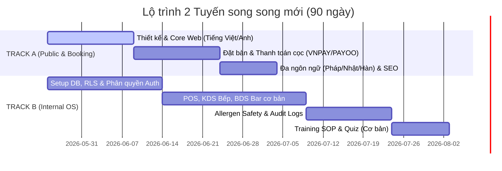

# BÁO CÁO NHẬN XÉT, PHẢN HỒI & PHẢN BIỆN Ý KIẾN CHUYÊN GIA
## Dự án Hệ thống Công nghệ Vận hành Maison Vie (Édition 2026)

Tài liệu này ghi nhận, phân tích sâu và phản hồi toàn diện đối với các nhận xét chuyên môn từ **03 Chuyên gia/Kỹ sư** đã thẩm định Bản kế hoạch triển khai tổng thể **Maison Vie (Master_Plan_01)**. Mục tiêu là tìm ra điểm cân bằng tối ưu giữa **tầm nhìn chiến lược dài hạn (Master Vision)** và **năng lực thực thi thực tế (Operational Execution)** để đảm bảo dự án go-live thành công, đúng hạn và không gây "ngộp" cho đội ngũ vận hành.

---

## I. TỔNG HỢP & ĐÁNH GIÁ CHUNG Ý KIẾN CỦA 03 CHUYÊN GIA

Cả 3 chuyên gia đều có sự đồng thuận rất cao ở các khía cạnh cốt lõi và chỉ ra những điểm nghẽn chí tử của bản kế hoạch hiện tại:

### 1. Những điểm mạnh được thừa nhận (Đáng giữ lại)
* **Tầm nhìn vượt trội (Enterprise-grade):** Hệ thống không đơn thuần là một website hay CRM rời rạc, mà hướng tới một **Restaurant Operating System** toàn diện cho mô hình Fine Dining cao cấp.
* **Độ sâu về Bảo mật & Pháp lý:** Đánh giá rất cao tư duy chủ động tuân thủ Nghị định 13/2023/NĐ-CP (mã hóa dữ liệu dị ứng AES-256 tầng DB, DPIA gửi A05) và cơ chế chống rò rỉ thông tin khách VIP (Watermark, audit log giải mã, 2FA/NFC).
* **Thấu hiểu thực tế vận hành Fine Dining:** Các cơ chế chống gian lận (Dual-auth void, Spoilage log, Opened Bottles Log, B2B Bulk Prep-Freeze Gate, VIP Cellar QR) được nhận định là đánh trúng các lỗ hổng thất thoát lớn trong thực tế.
* **Nguyên lý AI an toàn:** Đồng ý hoàn toàn với triết lý: *AI đề xuất (ghi bảng nháp) - Con người (ADMIN) phê duyệt*.

### 2. Các rủi ro chí tử được cảnh báo (Cần khắc phục ngay)
* **Lỗi quá tải tính năng (Over-engineering & Scope Creep):** Đưa quá nhiều tính năng "thượng thừa" (IoT cold chain, cân Bluetooth, proctored quiz FaceID, decanting breathing predictor, hologram tag...) vào Giai đoạn 1. Điều này gây loãng ưu tiên và tăng nguy cơ trễ hạn.
* **Timeline phi thực tế:** 49 ngày cho toàn bộ 6 giai đoạn của một hệ điều hành đồ sộ là **hoàn toàn không khả thi**. Thực tế cần từ 6–12 tháng nếu giữ nguyên scope.
* **Rủi ro vận hành (Staff Friction):** Thiết lập quá nhiều quy trình bắt buộc phức tạp (chụp ảnh, quét QR, OTP, dual-auth) sẽ tạo lực cản lớn cho nhân sự FOH/BOH trong giờ cao điểm, dẫn đến việc họ "bypass" hệ thống (dùng giấy hoặc bỏ ghi log).
* **Độ phức tạp kỹ thuật:** 
  * Cơ chế *Offline-first* (IndexedDB + last-write-wins sync) kết hợp với các logic ca trực động, allergen lock là cực kỳ khó làm và dễ sinh lỗi lệch bill/mất order.
  * Tích hợp quá nhiều bên thứ ba (VNPT, VNPAY, PAYOO, Cloudflare Stream, IoT gateway...) cùng lúc dễ bị kẹt API.
  * Supabase RLS quá phức tạp và nhiều trigger/cron job sẽ gây nghẽn hiệu năng vào giờ cao điểm.

---

## II. PHÂN TÍCH PHẢN BIỆN & PHẢN HỒI CHI TIẾT TỪ PHÍA NHÀ CUNG CẤP GIẢI PHÁP

Dưới đây là các luận điểm phản biện, giải trình kỹ thuật và phương án điều chỉnh trực tiếp từ Kỹ thuật viên triển khai đối với các góp ý của chuyên gia:

### 1. Phản biện về "Over-engineering" & Cắt giảm MVP 90 ngày
> [!NOTE]
> **Ý kiến chuyên gia:** Hệ thống đang bị "over-engineer" nặng, quá nhiều module phức tạp cho 1 nhà hàng đơn lẻ 250 chỗ. Cần cắt giảm tối thiểu 30-40% tính năng để tập trung core flow.

* **Phản hồi của chúng tôi (ĐỒNG Ý & ĐIỀU CHỈNH):**
  * Chúng tôi thừa nhận việc triển khai đồng thời IoT, cân Bluetooth và các hệ thống thi cử nâng cao ở Giai đoạn 1 là chưa thực sự cần thiết khi nhà hàng chưa go-live.
  * **Giải pháp điều chỉnh:** Áp dụng ma trận ưu tiên MoSCoW để khoanh vùng và đóng băng (freeze) các tính năng chưa critical sang **Phase 2 (Sau 3-6 tháng vận hành ổn định)**. 

#### Bảng Phân cấp Tính năng theo Ma trận MoSCoW Điều chỉnh
| Tính năng/Hạng mục | Phân loại | Hành động điều chỉnh |
| :--- | :---: | :--- |
| **Website mới & Menu đa ngôn ngữ** | **MUST** | Triển khai ngay, ưu tiên sửa lỗi font tiếng Việt và SEO. |
| **Booking & Cọc giữ chỗ (VNPAY/PAYOO)** | **MUST** | Triển khai ngay để chống no-show. |
| **Sơ đồ bàn 2D & POS-KDS-BDS Cơ bản** | **MUST** | Triển khai ngay để phục vụ vận hành hàng ngày. |
| **Quy trình Allergen Safety (KDS Lock & Tag)** | **MUST** | Triển khai ngay (an toàn của khách là trên hết). |
| **Bảo mật dữ liệu dị ứng & VIP Privacy** | **MUST** | Triển khai ngay phiên bản cơ bản (Mã hóa DB, Watermark). |
| **Hóa đơn điện tử VNPT e-Invoice** | **MUST** | Triển khai ngay để khớp thuế tự động. |
| **Hệ thống Đào tạo SOP & Quiz trắc nghiệm** | **SHOULD** | Rút gọn: Thi trắc nghiệm thường (không FaceID/Proctored), Video lưu trữ thường (chưa ký Signed URL phức tạp). |
| **Tự động trừ kho theo Recipe Master v3** | **SHOULD** | Chạy chế độ "lý thuyết đối chiếu" trước, chưa trừ kho vật lý tự động ngay lập tức để tránh lệch số liệu. |
| **IoT Cold Chain & Cân Bluetooth** | **COULD** | Đẩy sang Giai đoạn sau (Phase 2 - sau 6 tháng). |
| **Decanting Queue & Breathing Predictor** | **COULD** | Đẩy sang Giai đoạn sau (Phase 2). |
| **AI Forecasting (Dự báo tự động)** | **COULD** | Đẩy sang Giai đoạn sau (chờ có dữ liệu sạch 3-6 tháng). |

---

### 2. Phản biện về "Tách Track A (Website) và Track B (Internal OS)"
> [!TIP]
> **Ý kiến chuyên gia:** Tách dự án thành 2 track độc lập để tránh loạn ưu tiên: Track A (Public Website & Booking) và Track B (Internal Restaurant OS).

* **Phản hồi của chúng tôi (ĐỒNG Ý TUYỆT ĐỐI):**
  * Đây là góp ý mang tính chiến lược cực tốt giúp giảm tải áp lực cho đội phát triển và đảm bảo kinh doanh không bị ảnh hưởng.
  * **Giải pháp điều chỉnh:** Chúng tôi sẽ chia lộ trình triển khai thành **2 Tuyến (Tracks)** chạy song song nhưng có mốc go-live và tiêu chí nghiệm thu hoàn toàn độc lập:

---

### 3. Phản biện về "Quy trình Friction & Vận hành nhân viên"
> [!WARNING]
> **Ý kiến chuyên gia:** Quá nhiều thủ tục chụp ảnh, quét mã, OTP, dual-auth trong ca trực sẽ khiến nhân viên quá tải và tìm cách "bypass" hệ thống.

* **Phản hồi của chúng tôi (TIẾP THU & THAY ĐỔI):**
  * Chúng tôi đồng ý rằng giờ cao điểm fine dining là môi trường cực kỳ căng thẳng. Bất kỳ giây trễ nào cũng có thể ảnh hưởng đến trải nghiệm của khách.
  * **Giải pháp điều chỉnh:**
    1. **progressive Friction (Rào cản tăng dần):** Thay vì bắt buộc chụp ảnh/video cho mọi trường hợp Void món hay Spoilage ly đĩa, chúng tôi áp dụng **Hạn mức Tự quyết (Allowance Quota)**:
       * *Dưới hạn mức:* FOH/Bartender chỉ cần chọn lý do có sẵn từ menu POS (không cần chụp ảnh, không cần Manager duyệt).
       * *Vượt hạn mức (ví dụ: làm vỡ ly pha lê giá trị lớn, void hóa đơn > 1 triệu):* Hệ thống mới kích hoạt luồng kiểm soát chặt (chụp ảnh và dual-auth).
    2. **Đơn giản hóa KDS Screen Freeze:** Chỉ khóa màn hình KDS khi có thay đổi dị ứng liên quan trực tiếp đến các món đang chế biến tại trạm đó (không khóa toàn bếp). Thay PIN code của Chef bằng thao tác chạm thẻ từ NFC (1 chạm mất 0.5 giây) để giảm ma sát vận hành.

---

### 4. Phản biện về "Kỹ thuật Offline-First & Supabase Performance"
> [!CAUTION]
> **Ý kiến chuyên gia:** Offline-first dùng IndexedDB + sync với last-write-wins cực kỳ phức tạp và rủi ro. RLS quá nested sẽ làm sập connection pool của Supabase khi có tải lớn.

* **Phản hồi của chúng tôi (TIẾP THU GIẢI PHÁP THỰC TẾ):**
  * Ý kiến phản biện này cực kỳ chính xác về mặt kiến trúc phần mềm. Việc cố gắng giải quyết xung đột dữ liệu order ngoại tuyến bằng code tự động dễ dẫn đến mất món hoặc nhân đôi món tại KDS.
  * **Giải pháp điều chỉnh:**
    1. **Hạ cấp ưu tiên Offline-First:** Trong 6 tháng đầu, chúng tôi sẽ sử dụng giải pháp vật lý đáng tin cậy hơn: **Mạng Internet dự phòng đa tuyến (1 line Cáp quang chính + 1 line Cáp quang backup + 1 Router 4G/5G tự động chuyển mạch)**.
    2. **Quy trình thủ công dự phòng (Fallback SOP):** Soạn thảo SOP hướng dẫn FOH chuyển sang order giấy ghi tay khi mất điện/mất mạng toàn bộ. KDS/POS chỉ cần lưu cache cục bộ tạm thời để in bếp qua LAN mà không thực hiện sync tự động phức tạp.
    3. **Tối ưu hóa Supabase RLS:** Loại bỏ các policy truy vấn lồng nhau (nested subqueries). Thay vào đó, gán trực tiếp thông tin phân quyền vào token JWT của người dùng lúc đăng nhập. Sử dụng Postgres Views để đơn giản hóa các truy vấn phức tạp trên KDS/POS nhằm bảo vệ connection pool.

---

## III. ĐỀ XUẤT LỘ TRÌNH ĐIỀU CHỈNH CHI TIẾT (LỘ TRÌNH 3 LÀN SÓNG)

Để Chủ đầu tư dễ trình bày với các đối tác và kiểm soát chất lượng, chúng tôi tái cấu trúc Lộ trình triển khai thành **3 Làn sóng (Waves)** rõ ràng trong vòng 12 tháng:

### LÀN SÓNG 1: FOUNDATION & REVENUE GENERATION (Ngày 1 đến Ngày 45)
* **Trọng tâm:** Khởi tạo dòng doanh thu trực tuyến, củng cố bảo mật nền tảng và tối ưu trải nghiệm đặt bàn.
* **Hạng mục bàn giao:**
  * Track A: Website đa ngôn ngữ mới (font Cormorant & Outfit chuẩn Việt), trang Wine List cơ bản, Trang Blog chuẩn SEO, Luồng đặt bàn tự động/thủ công giờ cao điểm.
  * Tích hợp thanh toán cọc giữ chỗ (VNPAY/PAYOO) và hoàn cọc ngoại lệ (Waiver).
  * Cấu hình DNS Subdomain `@booking.maisonvie.vn` tách biệt hòm thư Google Business chính.
  * Track B: Supabase Database (3NF), mã hóa dữ liệu dị ứng AES-256 tầng DB, phân quyền RLS cơ bản (Admin/Manager/Chef/FOH).

### LÀN SÓNG 2: CORE OPERATIONS DIGITIZATION (Ngày 46 đến Ngày 90)
* **Trọng tâm:** Số hóa toàn bộ quy trình vận hành trực tiếp tại nhà hàng.
* **Hạng mục bàn giao:**
  * Sơ đồ bàn 2D kéo thả kết hợp khóa bàn tự động 120 phút và chuyển bàn (Table Swapping) thời gian thực.
  * POS bán hàng, tách hóa đơn đa chiều (multi-splitting), kết nối API xuất hóa đơn điện tử VNPT e-Invoice.
  * KDS Bếp & BDS Quầy Bar (luồng orderrouting độc lập, Runner Alert, Gala Mode gom lô).
  * Quy trình kiểm soát dị ứng khẩn cấp (Strobe Alert, tem đỏ tag, Allergen Sideboard).
  * Hệ thống đào tạo nhân sự SOP tĩnh kết hợp thi trắc nghiệm không FaceID.
  * Opened Bottles Log và Quy trình nhập - xuất kho Bar cơ bản (nhập kho, trừ theo POS).

### LÀN SÓNG 3: ADVANCED OS & AUTOMATION (Tháng thứ 4 đến Tháng thứ 12)
* **Trọng tâm:** Tối ưu hóa chi phí, chống thất thoát chuyên sâu và ứng dụng AI.
* **Hạng mục bàn giao:**
  * Tự động trừ kho tổng theo Recipe Master v3 (sau khi đã hiệu chỉnh sai lệch 3 tháng).
  * Tích hợp cân điện tử Bluetooth cho tồn kho Bar và Sommelier Tasting.
  * Cảm biến IoT giám sát chuỗi lạnh tủ đông tủ mát (Cold Chain logs).
  * Quy trình VIP Cellar nâng cao (Tem vỡ Hologram, MD5 băm ảnh seri).
  * Anti-cheating proctored quiz (FaceID/OTP) cho LMS nhân sự.
  * AI Forecasting dự báo nhập hàng dựa trên machine learning và Special Events Calendar.

---

## IV. BẢNG ĐÁNH GIÁ SỰ ĐỒNG THUẬN SAU PHẢN BIỆN (ALIGNMENT MATRIX)

Dưới đây là ma trận thể hiện mức độ tiếp thu và xử lý của chúng tôi đối với các khuyến nghị của 3 chuyên gia:

| Nội dung khuyến nghị | Chuyên gia 1 | Chuyên gia 2 | Chuyên gia 3 | Phương án xử lý của chúng tôi | Trạng thái |
| :--- | :---: | :---: | :---: | :--- | :---: |
| **Cắt giảm Scope xuống MVP** | 🔴 Cảnh báo | 🔴 Cảnh báo | 🔴 Cảnh báo | Áp dụng MoSCoW, chuyển 40% tính năng sang Phase 2/3. | **ĐÃ THỐNG NHẤT** |
| **Tách Track Web và Track OS** | 🟢 Đề xuất | 🟢 Đề xuất | - | Chia thành Track A (Web) và Track B (OS) chạy song song. | **ĐÃ THỐNG NHẤT** |
| **Kéo dài timeline thực tế** | 🔴 6-12 tháng | 🔴 6-12 tháng | 🔴 Cần giãn | Lộ trình 3 Làn Sóng kéo dài 12 tháng (Go-live MVP sau 90 ngày). | **ĐÃ THỐNG NHẤT** |
| **Giảm ma sát (Friction) nhân viên** | - | 🔴 Cảnh báo | 🔴 Cảnh báo | Áp dụng hạn mức tự quyết, thay PIN bằng NFC chạm, thu gọn KDS Lock. | **ĐÃ THỐNG NHẤT** |
| **Hạ cấp độ Offline-first** | 🔴 Rủi ro cao | 🔴 Rủi ro cao | 🔴 Cảnh báo | Ưu tiên mạng đa tuyến dự phòng phần cứng + SOP giấy làm core. | **ĐÃ THỐNG NHẤT** |
| **Hoãn tự động trừ kho vật lý** | 🟢 Đề xuất | - | 🟢 Đề xuất | Chạy đối chiếu lý thuyết trước 3 tháng trước khi trừ tự động. | **ĐÃ THỐNG NHẤT** |

---

## V. KẾT LUẬN & ĐỀ NGHỊ HÀNH ĐỘNG TIẾP THEO

Bản nhận xét của 03 chuyên gia là những đóng góp vô cùng giá trị, giúp dự án Maison Vie tránh được những cái bẫy công nghệ thường gặp trong ngành F&B. Việc giữ nguyên bản **Master_Plan_01** làm **"Tầm nhìn Chiến lược 2 năm"** là hoàn toàn đúng đắn. Tuy nhiên, việc điều chỉnh lộ trình thực thi thành **Lộ trình 3 Làn Sóng (MVP 90 ngày)** sẽ giúp dự án:
1. Giảm thiểu rủi ro trễ hạn go-live nhà hàng.
2. Tiết kiệm ngân sách ban đầu, chỉ đầu tư công nghệ sâu khi đã có doanh thu.
3. Nhân viên có thời gian tiếp thu quy trình từ từ, tránh gây sốc văn hóa công nghệ.

> [!IMPORTANT]
> **Khuyến nghị gửi Chủ đầu tư:** 
> Kính đề nghị Chủ đầu tư phê duyệt Phương án điều chỉnh Lộ trình 3 Làn sóng trên để chúng tôi cập nhật chính thức vào tài liệu thiết kế hệ thống và bắt đầu xây dựng Giai đoạn 1.
